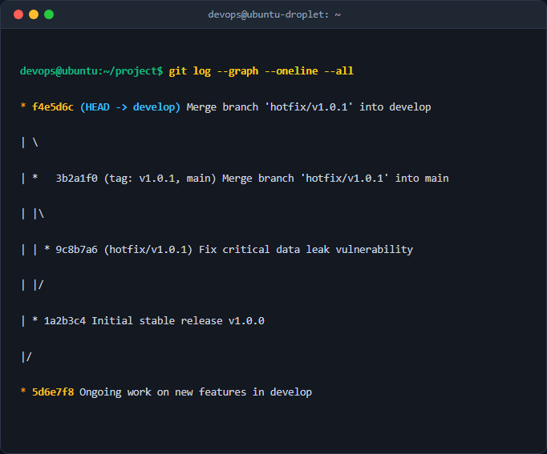

# Báo cáo Kỹ thuật: Mô phỏng Quy trình Hotfix & Gitflow Thực tế

## 1. Mục tiêu & Bối cảnh Kỹ thuật
- **Bối cảnh**: Hệ thống đang chạy ổn định trên nhánh `main` (phiên bản `v1.0.0`) gặp lỗi nghiêm trọng lộ dữ liệu người dùng. Nhánh `develop` đang phát triển dở dang các tính năng mới và không thể deploy ngay.
- **Mục tiêu**: Áp dụng mô hình Gitflow để tạo nhánh `hotfix/v1.0.1` từ `main`, khắc phục sự cố, gộp ngược lại `main` kèm thẻ tag `v1.0.1`, đồng thời đồng bộ hóa bản vá về nhánh `develop` để tránh trôi lỗi.

## 2. Các bước thực hiện chi tiết
- **Bước 1: Khởi tạo và chuyển sang nhánh `main`**
  - Lệnh: `git checkout main` (chuyển về nhánh sản xuất).
- **Bước 2: Tạo nhánh khẩn cấp `hotfix/v1.0.1`**
  - Lệnh: `git checkout -b hotfix/v1.0.1` (tạo và chuyển sang nhánh hotfix trực tiếp từ `main`).
- **Bước 3: Thực hiện sửa lỗi và commit**
  - Chỉnh sửa mã nguồn Java (`App.java`), sau đó thực hiện lệnh: `git commit -am "Fix critical data leak vulnerability"`.
- **Bước 4: Gộp nhánh hotfix vào `main` và tạo tag**
  - Chuyển về `main`: `git checkout main`
  - Gộp mã: `git merge --no-ff hotfix/v1.0.1 -m "Merge hotfix v1.0.1 into main"`
  - Tạo tag: `git tag -a v1.0.1 -m "Release Hotfix 1.0.1"`
- **Bước 5: Đồng bộ hóa về nhánh `develop`**
  - Chuyển về develop: `git checkout develop`
  - Gộp mã: `git merge --no-ff hotfix/v1.0.1 -m "Merge hotfix v1.0.1 into develop"`
- **Bước 6: Dọn dẹp nhánh hotfix**
  - Lệnh: `git branch -d hotfix/v1.0.1`

## 3. Kiểm tra & Xác thực kết quả
- Lệnh kiểm tra sơ đồ Git:
  ```bash
  git log --graph --oneline --all
  ```
- Kết quả thực tế được ghi nhận qua ảnh chụp terminal:


## 4. Kết luận & Best Practices bảo mật vận hành
- Luôn tách nhánh hotfix trực tiếp từ `main` để đảm bảo không mang theo các tính năng chưa ổn định từ `develop` vào môi trường Production.
- Bắt buộc đồng bộ ngược bản vá về `develop` ngay sau khi release để ngăn chặn lỗi tái diễn trong các phiên bản tương lai.